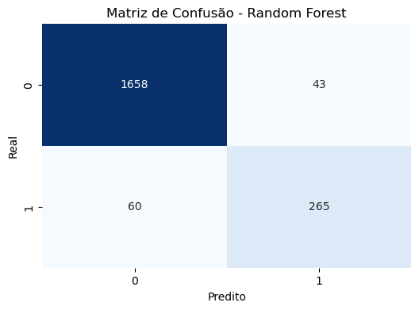
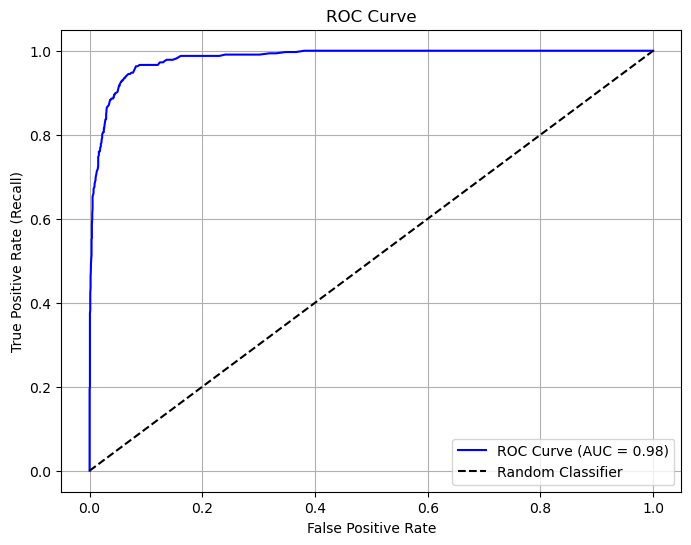

# Bank Churn
### Este projeto visa estudar e praticar técnicas de Data Science utilizando um dataset de churn (perda de clientes) em bancos.

**Objetivo:**

Nesse projeto irei desenvolver modelos de machine learning para previsão de churn em um banco (perda de clientes). Irei comparar seus resultados, e indicar qual dos modelos teve o melhor desempenho baseado nas metricas de F1, precision, recall e Roc-Auc.

Para apoiar a definição de estratégias mais eficientes de retenção de clientes.

**O projeto foi dividido em três etapas principais:**

- **Análise exploratória:** Etapa inicial para buscar melhor entendimento dos dados, identificar padrões, identificar exceções e mostrar visualmente estes casos. Buscando facilitar as proximas etapas e as tomadas de decisões
  
- **Tratamento de dados:** Aplicar de técnicas e metodos usados ciência de dados para tratar os dados tornando-os mais adequados para o treinados, técnicas como (SMOTE) para balanceamento dos dados, winsorização para lidar com os outliers.
  
- **Treinamento:** Após o tratamento dos dados, foram treinados diversos modelos de machine learning incluindo Random Forest, Árvore de Decisão, K-Nearest Neighbors e Regressão Logística. Todos foram testados com diferentes hiperparâmetros para verificar a melhor versão individual de cada modelo, dos quais o melhor foi selecionado.

---

## Tecnologias Utilizadas

- **Python** – Linguagem principal usada no projeto.
- **pandas** – Manipulação e análise de dados.
- **scikit-learn (sklearn)** – Biblioteca de machine learning com diversos recursos:
  - **Modelos:** `KNeighborsClassifier`, `RandomForestClassifier`, `DecisionTreeClassifier`, `LogisticRegression`
  - **Avaliação de desempenho:** `accuracy_score`, `precision_score`, `recall_score`, `f1_score`, `roc_auc_score`
  - **Pré-processamento e validação:** `train_test_split`, `GridSearchCV`, `StandardScaler`, `RobustScaler`
- **imbalanced-learn (imblearn)** – Técnicas para lidar com conjuntos de dados desbalanceados, como `SMOTE` e `Pipeline`.
- **matplotlib** – Criação de gráficos e visualizações básicas.
- **seaborn** – Visualizações estatísticas mais avançadas e estilizadas.

---

## Sobre o Dataset

O dataset utilizado disponibiliza dados de churn em clientes de um banco, contendo aproximadamente 10.000 registros.
Os dados são desbalanceados, o que exigiu a aplicação de técnicas de balanceamento, os dados também apresentam uma grande quantidade de outliers mostrando necessidade de serem tratados.

Mais informações e o dataset original estão disponíveis em:  
[Kaggle - Credit Card Customers Dataset](https://www.kaggle.com/datasets/sakshigoyal7/credit-card-customers)

---

## Resultados

Dos diversos modelos testados, dois se destacaram: Random Forest e Decision Tree. No entanto, o modelo Random Forest apresentou um desempenho igual ou superior em todas as métricas de avaliação, além de oferecer maior capacidade de reduzir o overfitting, o que contribuiu significativamente para a sua escolha como o modelo mais eficaz.

sendo essas e seus respectivos valores:

#### Resultados com o modelo de teste
|  f1   |  Recall  |  Precision  |  ROC AUC  |
|-------|----------|-------------|-----------|
| 83.7% | 81.5%    | 86.0%       | 98.2%     |

#### Matriz de confusão

#### ROC curve

Este valores indicam que o modelo é balanceado, com uma baixa taxa de falsos positivos e uma alta precisão nas previsões.

Também podemos concluir que o modelo tem uma excelente capacidade de distinguir entre os clientes que apresentam características de churn e os que não apresentam.

## Considerações

Sendo um dos meus primeiros projetos para o portfólio, sem supervisão de terceiros ou um "guia", encontrei algumas dificuldades ao longo do processo que me proporcionaram um aprofundamento nos meus conhecimentos como:

Tratamento de outliers:
- Funções prontas com o objetivo de minimizar seu impacto como RobustScaler
- Remoção ou substituição dos valores 
- Técnicas como winsorização e RobustScaler, que embora atuem de maneiras distintas, visam reduzir o impacto dos outliers

Matematica e estatistica:
- No processo de compreensão das funções e métodos que poderiam ser utilizados para lidar com os outliers, busquei entender os calculos por trás das funções, como o cálculo do z-score, que indica o posicionamento baseado na media utilizando o desvio padrão (Standard Deviation), ou RobustScaler que faz uso do IQR para reduzir a influencia dos valores extremos

## Conclusão
O modelo é capaz de distinguir e prever casos de churn, tornando-o ideal como ferramenta no auxilo da tomada de decisão
